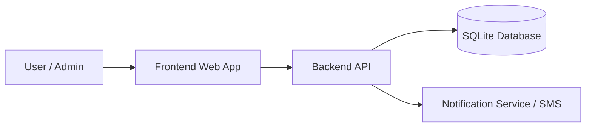

# Architecture Document

## 1. ภาพรวมของสถาปัตยกรรม
ระบบจัดการธนาคารขยะภายในชุมชนขนาดเล็กจะถูกพัฒนาเป็นเว็บแอปพลิเคชันแบบ 3-layer architecture โดยแบ่งเป็น 3 ส่วนหลักดังนี้

1. Frontend
   - เป็นส่วนติดต่อผู้ใช้ที่ให้ผู้ใช้และแอดมินใช้งานผ่านเว็บเบราว์เซอร์
   - รองรับการใช้งานทั้งบนมือถือและคอมพิวเตอร์
   - ทำหน้าที่แสดงข้อมูลสมาชิก ยอดขยะ ยอดเงิน และฟอร์มการจัดการข้อมูล

2. Backend API
   - ทำหน้าที่ประมวลผลกฎธุรกิจของระบบ เช่น การเข้าสู่ระบบ การบันทึกข้อมูลสมาชิก การบันทึกยอดขยะ และการคำนวณเงิน
   - ควบคุมสิทธิ์การเข้าถึงตามบทบาทผู้ใช้และแอดมิน
   - เชื่อมต่อกับฐานข้อมูลและบริการแจ้งเตือนภายนอก

3. Database
   - ใช้ SQLite ในการเก็บข้อมูลหลักของระบบ
   - เหมาะกับระบบขนาดเล็กถึงขนาดกลางที่ต้องการความง่ายในการติดตั้งและดูแล

---

## 2. สถาปัตยกรรมโดยรวม

---

## 3. องค์ประกอบของระบบ

### 3.1 Frontend
- แสดงหน้า Login
- แสดง Dashboard สำหรับผู้ใช้และแอดมิน
- แสดงข้อมูลสมาชิกและยอดขยะ
- แสดงผลลัพธ์การคำนวณเงิน
- รองรับหน้าจอเล็กและหน้าจอใหญ่

### 3.2 Backend
- Authentication Module
  - ตรวจสอบชื่อผู้ใช้และรหัสผ่าน
  - จัดการ session หรือ token
- User Management Module
  - จัดการข้อมูลผู้ใช้และบทบาท
- Member Management Module
  - เพิ่ม แก้ไข ลบ และค้นหาข้อมูลสมาชิก
- Waste Record Module
  - บันทึกยอดขยะสะสมของสมาชิกแต่ละคน
- Calculation Module
  - คำนวณเงินจากยอดขยะตามกฎที่กำหนด
- Notification Module
  - ส่งแจ้งเตือนผ่าน SMS หรือช่องทางแจ้งเตือนอื่น ๆ

### 3.3 Database
เก็บข้อมูลหลักดังนี้
- users
  - id
  - username
  - password_hash
  - role
- members
  - id
  - name
  - phone
  - address
  - status
- waste_records
  - id
  - member_id
  - waste_amount
  - recorded_date
  - recorded_by
- payments
  - id
  - member_id
  - amount
  - calculated_date
  - status
- notifications
  - id
  - member_id
  - message
  - sent_at
  - status

---

## 4. กระบวนการทำงานหลัก

### 4.1 การเข้าสู่ระบบ
1. ผู้ใช้ป้อน username และ password ที่ Frontend
2. Frontend ส่งข้อมูลไปยัง Backend API
3. Backend ตรวจสอบข้อมูลกับฐานข้อมูล
4. หากถูกต้องระบบจะอนุญาตให้เข้าสู่ระบบและกำหนดสิทธิ์ตามบทบาท

### 4.2 การบันทึกยอดขยะ
1. แอดมินเลือกสมาชิกที่ต้องการบันทึกข้อมูล
2. ระบบรับข้อมูลยอดขยะจากฟอร์ม
3. Backend บันทึกข้อมูลลงฐานข้อมูล
4. ระบบคำนวณยอดเงินตามกฎที่กำหนด
5. บันทึกผลการคำนวณลงฐานข้อมูลและส่งแจ้งเตือนหากจำเป็น

### 4.3 การดูข้อมูลของผู้ใช้
1. ผู้ใช้เข้าสู่ระบบแล้วเรียกดูข้อมูลของตนเอง
2. Backend ดึงข้อมูลจากฐานข้อมูล
3. Frontend แสดงยอดขยะ ยอดเงิน และข้อมูลแจ้งเตือน

---

## 5. โมดูลการพัฒนาแยกตามบทบาท

### ผู้ใช้ทั่วไป
- เข้าสู่ระบบ
- ดูข้อมูลส่วนตัว
- ดูยอดขยะและยอดเงิน
- รับแจ้งเตือนจากระบบ

### แอดมิน
- เข้าสู่ระบบด้วยสิทธิ์พิเศษ
- จัดการข้อมูลสมาชิก
- บันทึกและปรับปรุงข้อมูลขยะ
- ควบคุมการคำนวณเงิน
- ดูรายงานและจัดการการแจ้งเตือน

---

## 6. เหตุผลในการเลือกสถาปัตยกรรมนี้
- เหมาะกับระบบขนาดเล็กถึงกลาง
- แยก Frontend และ Backend ทำให้พัฒนาและบำรุงรักษาได้ง่าย
- ใช้ SQLite ช่วยลดความซับซ้อนของการติดตั้ง
- รองรับการขยายระบบในอนาคต เช่น เพิ่ม API, เพิ่มแผนกหรือบริการแจ้งเตือนเพิ่มเติม

---

## 7. ข้อกำหนดด้านความปลอดภัย
- ใช้การเข้ารหัสรหัสผ่านก่อนเก็บในฐานข้อมูล
- ตรวจสอบสิทธิ์การเข้าถึงตามบทบาท
- แยกข้อมูลที่เป็นส่วนตัวจากข้อมูลทั่วไป
- ป้องกันการเข้าถึงโดยไม่ได้รับอนุญาต

---

## 8. ข้อสรุป
ระบบนี้ควรออกแบบเป็นเว็บแอปพลิเคชันที่แยกส่วนการแสดงผล การประมวลผล และการจัดเก็บข้อมูลอย่างชัดเจน เพื่อให้สามารถพัฒนาและดูแลได้ง่าย พร้อมทั้งรองรับการใช้งานของทั้งผู้ใช้ทั่วไปและแอดมินในชุมชนขนาดเล็ก
